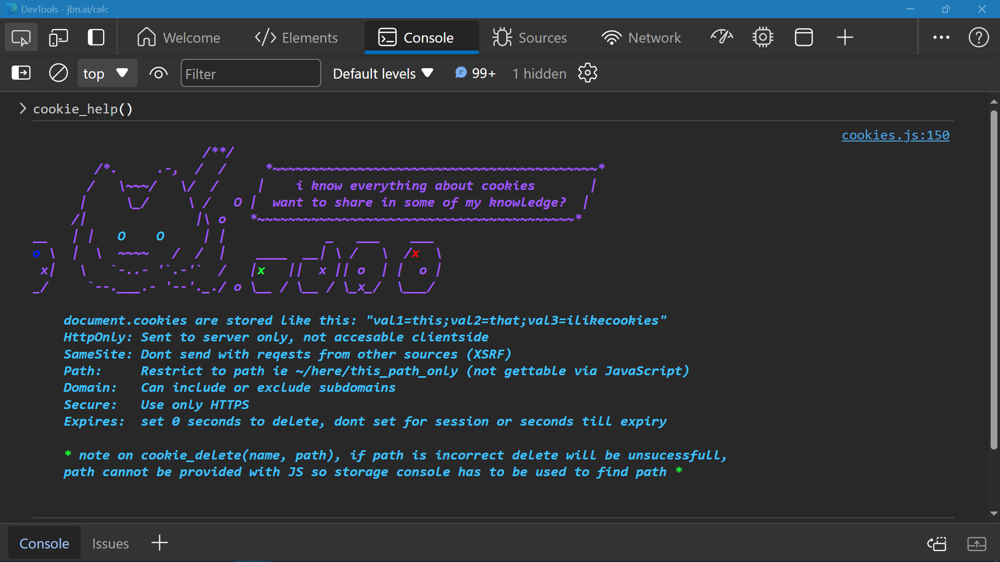

# Cookies.js




## Functions

### cookie_set()
Set new cookie or overwrite cookie with the same name.
```JavaScript
/**
//~  set site cookie
//~  'value' can be any type but will be set as string
//~  (optional) path can be set to limit cookie to subdirectory (ie /shop/product)
//~  re-setting cookie with same 'name' & 'path' will overwrite
//~  note: in addition to clientside, cookies are sent to server on GET request
 * @param {string} name
 * @param {any} value
 * @param {string=} optional_path
 * @returns {boolean}
 */
function cookie_set(name, value, optional_path = '/') {

    const date = new Date();
    date.setTime(date.getTime() + (_cookie_expiration_days * 24 * 60 * 60 * 1000));
    let expires = date.toUTCString();
    document.cookie = `${name}=${value};SameSite=${_cookie_samesite};expires=${expires};path=${optional_path}`;

    return true;
}
```


### cookie_get()
Get value of named existing cookie.
```JavaScript

/**
//~  get cookie using 'name'
//~  returns value OR
//~  if not present returns string "404"
//~  note: firefox (unlike chrome) will show all path data but only proper path data will be retrieved (May 23)
 * @param {string} name
 * @returns {string | "404"}
 */
function cookie_get(name) {

    if (
        document.cookie
            .split(";").some((item) => item.trim().startsWith(`${name}=`))
    ) {
        return document.cookie
            .split("; ").find((row) => row.startsWith(`${name}=`))?.split("=")[1];
    }
    else
    {
        return "404";
        //return false;
        // debating this return type //
    }
}
```
### cookie_delete()
Delete named cookie if exists else do nothing.
```JavaScript
/**
 *  delete 'name'ed site cookie
 *  (optional) path, will be needed if path set, must match
 *  * if correct path is not specified, delete will be unsucessfull,
 *  path cannot be accessed via JavaScript therefore the storage pane in console 
 *  has to be used if unsure *
 * @param {string} name
 * @param {string=} path
 */
function cookie_delete(name, path = '/') {

    document.cookie =
        `${name}=;expires=Thu, 01 Jan 1970 00:00:00 UTC;SameSite=${_cookie_samesite};path=${path};`;
}
```

### cookie_consolelog()
Quick printout of functions available from cookies.js
```JavaScript
/**
 *  [Console Function]
 *  cookie_consolelog (help)
 *  quick console printout of functions, for use inside the console
 * @returns {boolean}
 */
function cookie_consolelog() {

    console.clear();
    console.log(
`%ccookie_consolelog();

%c⬘%c cookie_set(name, value, path = '/')
%c⬘%c cookie_get(name)
%c⬘%c cookie_delete(name, path = '/')
%c⬘%c cookie_get_all()
%c⬘%c cookie_help()
`       , _cookie_console_colors[1],
        ...Array(5).fill(_cookie_console_colors).flat()
    );
    return true;
}
```
